<iframe src="https://slides.com/morrain/deck/embed" width="576" height="420" scrolling="no" frameborder="0" webkitallowfullscreen mozallowfullscreen allowfullscreen></iframe>

# 打通任督二脉之webpack 4.x从入门到精通


<!-- vscode-markdown-toc -->
* 1. [前言](#)
* 2. [关于Webpack](#Webpack)
* 3. [Webpack 4.x 从入门到精通](#Webpack4.x)
	* 3.1. [安装](#-1)
	* 3.2. [entry&output](#entryoutput)
	* 3.3. [loader](#loader)
		* 3.3.1. [loader介绍](#loader-1)
		* 3.3.2. [babel-loader](#babel-loader)
	* 3.4. [plugin](#plugin)
		* 3.4.1. [调试webpack的运行过程](#webpack)
		* 3.4.2. [理解plugin从编写一个plugin开始](#pluginplugin)
		* 3.4.3. [从plugin的运行机制看webpack的全生命周期](#pluginwebpack)
* 4. [如何使用webpack做长效缓存](#webpack-1)
	* 4.1. [什么是长效缓存](#-1)
* 5. [参考文献](#-1)

<!-- vscode-markdown-toc-config
	numbering=true
	autoSave=true
	/vscode-markdown-toc-config -->
<!-- /vscode-markdown-toc -->


##  1. <a name=''></a>前言

首先来分析一下这篇文章的标题：《打通任督二脉之webpack 4.x从入门到精通》，它不是webpack从入门到精通的教程，因为但凡了解的人都知道webpack的强大，强大到不是通过一篇或者几篇文章就能从入门到精通的，所以我在前面加了前缀：打通任督二脉！我希望的是通过这个文章，能打通你对webpack的任督二脉，找到从入门到精通的方法，然后通过持之以恒的练习，来达到精通webpack的目的。所以本文是介绍精通webpack的方法，而不是介绍精通webpack本身。

##  2. <a name='Webpack'></a>关于Webpack

在介绍webpack之前，我们先简单回顾一下前端的发展历史。前端的蓬勃发展得益于Google 的V8引擎。2008年9月2号，当Chrome第一次出现的时候（V8与Chrome同一天宣布开源），它对网页的加载速度让所有人惊叹，是V8引擎把JavaScript的运行速度提上来了，让前端从蒸汽机机时代正式步入内燃机时代。

那V8又是在什么背景下诞生的呢？谷歌针对浏览器开发了谷歌地图，而这对浏览器的处理能力提出了更高的要求。那时的 JavaScript 实现尚不足以快速地运行地图。谷歌想要吸引更多的用户使用谷歌地图的服务，从而进行广告销售并牟利。基于这个原因，这项服务必须快速且稳定。因此谷歌自己用 C++ 开发了 V8 引擎并在 2008 年启用，就像一些人说的，它的速度是最快的。微软的Edge浏览器也即将使用V8引擎。

如下图所示，早在Chrome发布之初的介绍漫画书中就有提到V8是独立于浏览器之外的，明确了将V8嵌入到非浏览器项目中的可能性，并且Node.js做到了！2009年诞生的Node.js和2010年诞生的npm,迅速将JavaScript变成全球最受欢迎的生态系统之一。前端正式从石器时代进入到了工业化时代。


但紧接着问题也随之而来：CommonJS伴随Node.js问世，并引入了require包管理机制，它允许开发者在当前文件中加载和使用某个模块，CommonJS 是 Node.js项目的绝佳解决方案，但浏览器不支持，(请参考[前端模块化](https://docs.google.com/presentation/d/1VACp58xC5hJesneskKQZ2zbv5YfbbzT7tlMGQeXyBh8/edit#slide=id.g4fecafb3d3_0_15))。并且随着ECMAScript Module标准的制定，浏览器厂商跟不上前端迅猛发展的节奏，新的规范和标准当前的浏览器不支持！于是开发者们就在探索是否可以有一种方式，让开发者在编写模块时可以使用最新的标准，并且支持任意模块规范，还能在当下的浏览器上正常使用。这就是webpack出现的原因。

**它是如此！但远不止于此！** 

它是一个工具，可以打包你的 JavaScript 应用程序（支持ESModule 和 CommonJS），可以扩展为支持许多不同的资源，例如：图片、字体、样式等等。webpack还关心性能和加载时间；它始终在改进和添加新功能，例如：异步模块加载，以便为不同项目和用户提供最佳体验。

##  3. <a name='Webpack4.x'></a>Webpack 4.x 从入门到精通

首先介绍一下webpack的[官方文档](https://webpack.js.org/concepts)，它分为Concepts（概念）、Guides（指南）、Configuration（配置）、Loaders（加载器）、Plugins（插件）、Api（接口）、Migrate（迁移）七个部分。

**Concepts**中介绍了webpack相关的概念，一定要先熟悉，不然文档可能会看不懂，因为文档中会提到，当然不用刚开始就把所有的概念都弄得非常清楚，可以在阅读文档学习webpack的过程中碰到不明白的概念，回到Concepts中查阅就好了。

**Guides**中就以实例的形式，一步一步讲解webpack的使用。也应该是最先阅读的部分。

**Configuration**中详细介绍了webpack使用的配置项。了解过webpack的应该知道，webapck主要难点就是配置项比较复杂。

**Loaders**中列举了webpack常用的加载器。webpack默认只能打包JavaScript的，但Loader顾名思义就是为了扩展webpack能够处理的文件类型，通过使用不同的Loader，可以让webpack打包任何静态资源。

**Plugins**中列举了webpack常用的插件。如果说Loader是针对特定类型文件的预处理操作，那么Plugin就是用来完成Loader不能完成的事情，譬如压缩、提取公共代码块等等。

**Api**中主要介绍定制化webpack编译过程会使用到的各种接口。包括开发Loader/Plugin会使用的api以及使用提供给Node使用的接口，来达到对编译的更细粒度的控制。

**Migrate**中主要介绍webpack迁移的方法以及注意事项。需要时看就好了。


友情提醒一下：**不要看中文文档，不要看中文文档，不要看中文文档**


###  3.1. <a name='-1'></a>安装

>安装前请确认安装了Node。

创建工程目录，然后在工程目录执行如下命令：

```bash
npm init
```
根据提示一步一步创建npm包，完成后会生成package.json的文件。对此不懂的请参考npm官网对[package.json](https://docs.npmjs.com/files/package.json)的介绍。

```bash
npm i -D webpack
npm i -D webpack-cli
```

>使用webpack 4+的版本，必须安装webpack-cli

然后在项目中建立src文件，并在其中新建index.js文件。在package.json中添加如下构建指令：

```json
// package.json  
"scripts": {
    "start": "webpack"
}
```

因为webpack是开箱即用的，刚开始不需要做任何配置，默认从src/index.js寻找入口，输出到dist/main.js文件。所以此时我们执行如下命令：

```bash
npm run start
```

可以看到工程目录生成dist文件夹，并且生成了main.js文件。此时会有点奇怪，src/index.js文件并没有任何内容，但dist/main.js却有内容输出，其实这就是webpack的runtime代码，**runtime是指在浏览器运行时，webpack用来管理模块的所有代码，包括模块的加载，解析以及缓存**。也就是说这些代码实现了：**无论你在src/index.js中选择哪种模块语法，import 或 require ，现在都被转换为 `__webpack_require__` 方法，从而实现统一的加载和管理。**

>上面加粗的暂时看不懂没关系

###  3.2. <a name='entryoutput'></a>entry&output

虽然webpack提供了开箱即用的功能，指定了默认的入口(src/index.js)和出口(dist/main.js)。但实际项目中我们都会进行配置，满足我们细粒度的打包要求，于是，我们需要新建一个配置文件webpack.config.js。

```js
// webpack.config.js
const path = require('path');

module.exports = {
    entry: './src/index.js',
    output: {
        filename: 'bundle.js',
        path: path.resolve(__dirname, './dist')
    }
};

```
修改package.json中的start指令，增加--config参数，指定刚才新建的配置文件。

>如果 webpack.config.js 在根目录存在，则 webpack 命令将默认选择使用它，也可以不用--config参数指定。

```json
// package.json
"scripts": {
    "start": "webpack --config webpack.config.js"
}
```
在index.js中增加一行代码：
```js
// src/index.js
console.log('hello webpack!')
```
执行如下命令，可以看到生成了dist/bundle.js文件。它就是打包好的文件。

```bash
npm run start
```
新建index.html,引入刚生成的bundle.js文件。在浏览器中打开index.html后，控制台中就输出了hello webpack。

```html
<!DOCTYPE html>
<html lang="en">
<head>
    <meta charset="UTF-8">
    <meta name="viewport" content="width=device-width, initial-scale=1.0">
    <meta http-equiv="X-UA-Compatible" content="ie=edge">
    <title>hello webpack</title>
</head>
<body>
    <script src="./dist/bundle.js"></script>
</body>
</html>
```
**接下来是重点！接下来是重点！接下来是重点！**

新建m.js，同时修改index.js，引入m模块。 **打包后，在浏览器调试，看看webpack是如何加载模块的。**

>由于webpack4默认是压缩代码的，为了方便阅读webpack的runtime源码，我们把默认的压缩去掉。

```js
// src/m.js
exports.log = function (info) {
    console.log(info);
}
// src/index.js
var log = require('./m').log;
log('load m module');

// webpack.config.js。为了去掉默认的压缩
module.exports = {
    optimization: {
        minimizer: []
    }
};

```
**一定要调试！一定要调试！一定要调试！** 通过调试去学习webpack runtime的源码。通过学习最基础的runtime源码，一定会让你醍醐灌顶，茅塞顿开。

**调试webpack打包后的源码是打通任督二脉的第一个秘诀！**

刚才我们调试了CommonJS(请参考[前端模块化](https://docs.google.com/presentation/d/1VACp58xC5hJesneskKQZ2zbv5YfbbzT7tlMGQeXyBh8/edit#slide=id.g4fecafb3d3_0_15))模块规范下，webpack的加载方式，现在我们把m.js的内容改成ESModule的规范，再打包调试。

>此时是m.js是ESModule模块标准导出，index.js使用CommonJS模块标准导入

```js
// src/m.js
export function log(info) {
    console.log(info);
}
```
打包好后，**一定要调试！一定要调试！一定要调试！** 

然后把m.js还原为CommonJS的标准，index.js使用ESModule的标准导入。

```js
 // src/m.js
 exports.log = function (info) {
     console.log(info);
 }
 
 // src/index.js
 import { log } from './m';
 log('load m module');

```

打包好后，**一定要调试！一定要调试！一定要调试！** 

最后index.js 和 m.js 都使用ESModule的模块规范：

```js
 // src/m.js
 export function log(info) {
    console.log(info);
 }
 
 // src/index.js
 import { log } from './m';
 log('load m module');

```
打包好后，**一定要调试！一定要调试！一定要调试！** 

我们调试完webpack的runtime代码后，基本能得出如下结论：

1. 不管用CommonJS的`require`&`exports` 还是ESModule的`import`&`export`，webpack都是转化为`__webpack_require__`方法来加载的
2. `__webpack_require__`更接近CommonJS的实现。
3. 对于ESModule规范的模块，会特殊处理，通过`Object.defineProperty`加上相应的`__esModule`的属性标识
4. `import`&`export`虽然是ESModule的规范，但却不需要Babel转码，可以webpack下开箱即用

>附上webpack runtime的源码

```js
/******/ (function(modules) { // webpackBootstrap
/******/ 	// The module cache
/******/ 	var installedModules = {};
/******/
/******/ 	// The require function
/******/ 	function __webpack_require__(moduleId) {
/******/
/******/ 		// Check if module is in cache
/******/ 		if(installedModules[moduleId]) {
/******/ 			return installedModules[moduleId].exports;
/******/ 		}
/******/ 		// Create a new module (and put it into the cache)
/******/ 		var module = installedModules[moduleId] = {
/******/ 			i: moduleId,
/******/ 			l: false,
/******/ 			exports: {}
/******/ 		};
/******/
/******/ 		// Execute the module function
/******/ 		modules[moduleId].call(module.exports, module, module.exports, __webpack_require__);
/******/
/******/ 		// Flag the module as loaded
/******/ 		module.l = true;
/******/
/******/ 		// Return the exports of the module
/******/ 		return module.exports;
/******/ 	}
/******/
/******/
/******/ 	// expose the modules object (__webpack_modules__)
/******/ 	__webpack_require__.m = modules;
/******/
/******/ 	// expose the module cache
/******/ 	__webpack_require__.c = installedModules;
/******/
/******/ 	// define getter function for harmony exports
/******/ 	__webpack_require__.d = function(exports, name, getter) {
/******/ 		if(!__webpack_require__.o(exports, name)) {
/******/ 			Object.defineProperty(exports, name, { enumerable: true, get: getter });
/******/ 		}
/******/ 	};
/******/
/******/ 	// define __esModule on exports
/******/ 	__webpack_require__.r = function(exports) {
/******/ 		if(typeof Symbol !== 'undefined' && Symbol.toStringTag) {
/******/ 			Object.defineProperty(exports, Symbol.toStringTag, { value: 'Module' });
/******/ 		}
/******/ 		Object.defineProperty(exports, '__esModule', { value: true });
/******/ 	};
/******/
/******/ 	// create a fake namespace object
/******/ 	// mode & 1: value is a module id, require it
/******/ 	// mode & 2: merge all properties of value into the ns
/******/ 	// mode & 4: return value when already ns object
/******/ 	// mode & 8|1: behave like require
/******/ 	__webpack_require__.t = function(value, mode) {
/******/ 		if(mode & 1) value = __webpack_require__(value);
/******/ 		if(mode & 8) return value;
/******/ 		if((mode & 4) && typeof value === 'object' && value && value.__esModule) return value;
/******/ 		var ns = Object.create(null);
/******/ 		__webpack_require__.r(ns);
/******/ 		Object.defineProperty(ns, 'default', { enumerable: true, value: value });
/******/ 		if(mode & 2 && typeof value != 'string') for(var key in value) __webpack_require__.d(ns, key, function(key) { return value[key]; }.bind(null, key));
/******/ 		return ns;
/******/ 	};
/******/
/******/ 	// getDefaultExport function for compatibility with non-harmony modules
/******/ 	__webpack_require__.n = function(module) {
/******/ 		var getter = module && module.__esModule ?
/******/ 			function getDefault() { return module['default']; } :
/******/ 			function getModuleExports() { return module; };
/******/ 		__webpack_require__.d(getter, 'a', getter);
/******/ 		return getter;
/******/ 	};
/******/
/******/ 	// Object.prototype.hasOwnProperty.call
/******/ 	__webpack_require__.o = function(object, property) { return Object.prototype.hasOwnProperty.call(object, property); };
/******/
/******/ 	// __webpack_public_path__
/******/ 	__webpack_require__.p = "";
/******/
/******/
/******/ 	// Load entry module and return exports
/******/ 	return __webpack_require__(__webpack_require__.s = 0);
/******/ })
/************************************************************************/
/******/ ([
/* 0 */
/***/ (function(module, __webpack_exports__, __webpack_require__) {

"use strict";
__webpack_require__.r(__webpack_exports__);

// CONCATENATED MODULE: ./src/m.js

function log (info) {
    console.log(info);
}
// CONCATENATED MODULE: ./src/index.js
console.log('hello webpack')


log('load m module');

/***/ })
/******/ ]);
```

###  3.3. <a name='loader'></a>loader

####  3.3.1. <a name='loader-1'></a>loader介绍

loader 用于对模块的源代码进行转换。loader可以在 `import` 或者 `require` 模块时预处理文件。上一节已经看到如何加载一个模块了，但我们并没有配置loader啊，原因是webpack能默认处理JavaScript文件。如果要加载其它类型的文件就需要配置相应类型的loader。譬如 像如下一份常用的loader配置：

```js
// webpack.config.js
const path = require('path');

module.exports = {
    entry: './src/index.js',
    output: {
        filename: 'bundle.js',
        path: path.resolve(__dirname, './dist')
    },
    optimization: {
        minimizer: []
    },
    module: {
        rules: [
            {
                test: /\.js$/,
                loader: 'babel-loader',
                include: [path.resolve(__dirname, '../src')]
            },
            {
                test: /\.(png|jpe?g|gif|svg)(\?.*)?$/,
                loader: 'url-loader',
                options: {
                    limit: 10000,
                    name: path.posix.join('static', 'img/[name].[hash:7].[ext]')
                }
            },
            {
                test: /\.sass$/,
                use: [
                    'style-loader',
                    {
                        loader: 'css-loader',
                        options: {
                            sourceMap: true
                        }
                    },
                    'sass-loader'
                ]
            }
        ]
    }
};

```
如上所示，loaders的配置方法比较灵活，详细可以参考官网文档[介绍Loader](https://webpack.js.org/concepts/loaders)的章节。项目中用到什么类型的的文件，就安装并配置相应的loader就好了，不同loader如何使用要case by case的看。

有一点需要注意：某种类型的文件，可能需要多个loader处理，所以loader是支持链式调用的，有点类似与gulp中的pipeline。**一组loader将按照相反的顺序执行**。例如上例中对.sass文件的处理，首先经过sass-loader的处理，完了后交给css-loader处理，最后交给style-loader处理。sass-loader用来处理sass语法，转化为css。css-loader用来处理css中的@import&url()。sytle-loader用于将css插入到DOM中的`<style>`标签上去。

我们重点看下babel-loader的使用，通过它可以举一反三。

####  3.3.2. <a name='babel-loader'></a>babel-loader

刚才说了webpack的loader的作用，对应的babel-loader就是用来处理ES6+的语法，把ES的新特性转化为浏览器支持的，可以执行的js语法，**注意我的用词哈，我说的不是转化为ES5。因为不同类型的以及不同版本的浏览器对ES新特性的支持程度都不一样，对于浏览器已经支持的部分，我们可以不转化，所以Babel会依赖浏览器的版本，后面会讲到。**  这里可以先请参考后面会用到的[browerslist](https://twitter.com/browserslist)项目。

首先Babel([官网](https://babel.docschina.org/docs/en/))是独立与webpack的，它可以应用于任何打包工具，或者在Node Cli直接使用。所以在webpack中使用就分为两个部分：

- 一是安装和配置babel-loader 
- 二是安装和配置Babel

我们先建立一个测试文件testBabel.js，用ES6语法写的模块。这样在后面逐步的配置过程中，能方便的看到编译的结果。index.js中导入testBabel.js这个模块。

```js
// src/testBabel.js
setTimeout(() => {
    let a = 'morrain';
    let b = 'morrain2';
    console.log(`timer done! ${a} do it`);
    console.log(a + b);
}, 1000);

let array = [1, 2, 3, 4, 5, 6];
array.includes(item => item > 2);

let tpx = new Promise((resolve, reject) => {
    console.log('new Promise done');
});

Object.assign({}, {
    a: 1,
    b: 2
});

// src/index.js
console.log('hello webpack')
import './testBabel';
```
运行如下命令打包，发现打完包的模块，没有经过任何编译，ES6的语法原封未动。但用最新的chrome浏览器打开，是能完全正常执行的，因为最新的chrome浏览器是支持这些特性的。

```bash
npm run start
```
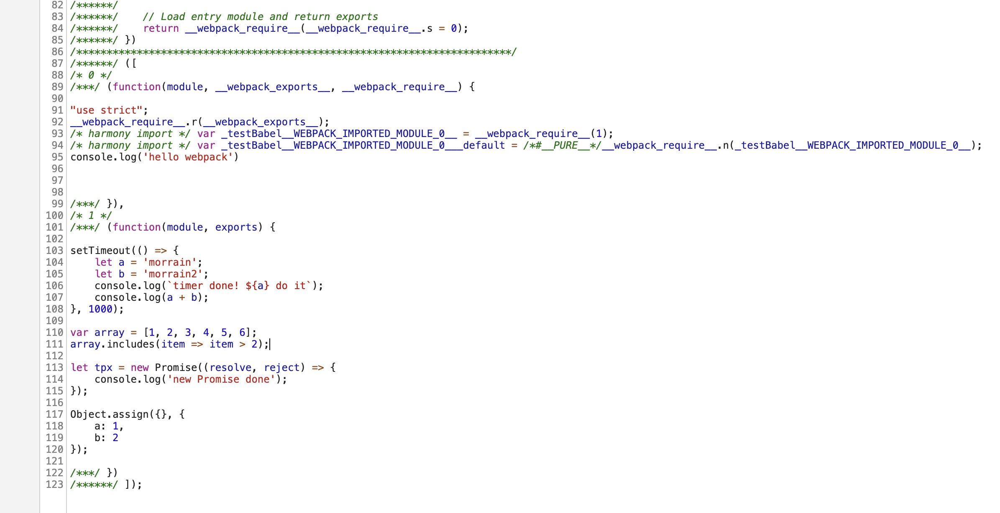


##### 安装和配置babel-loader 

```bash
npm i -D babel-loader
```

```js
// webpack.config.js
module.exports = {
    ……
    module: {
        rules: [//增加对js文件使用babel-loader进行解析的配置
            {
                test: /\.js$/,
                loader: 'babel-loader',
                include: [path.resolve(__dirname, './src')]
            }
        ]
    }
};

```

>上面的include对于性能提升比较重要，它限定了使用babel-loader进行处理的模块范围，因为项目中难免会用到很多第三方的npm包，我们并不希望处理这些内容。也可以使用exclude参数

##### 安装和配置Babel

上面配置好babel-loader后打包会报错，因为我们还需要安装和配置Babel。可以参考Babel([官网](https://babel.docschina.org/docs/en/))

1. Babel的历史

简单讲Babel就是JavaScript的编译器，将ES6+转换成浏览器支持的、可执行的js语法。它的前身是`6to5`这个库，2014年发布主要是将ES6转成ES5，它使用的AST(抽象语法树)引擎是一个更古老的库`acorn`。2015年2月15号，6to5与另一个`Esnext`项目合并，并改名为了Babel。这里确实要感叹一下，Babel这个名字起的是真好，Babel是巴比伦文化里面的通天塔，贴切得很。羡慕有一些牛逼的人，代码写得好不说，还这么有文化。不像我们，为了起个变量名，都要憋上半天，吃了没有文化的亏。


2. Babel的使用

在安装和配置Babel之前，我们先了解一下[Babel的设计与组成](https://mp.weixin.qq.com/s?__biz=MzAwOTkzNDc0Mg==&mid=2247483750&idx=1&sn=c90e95159199ac7aa2612207e89e9182&chksm=9b59439fac2eca89bc558fd2a360408bf8e8a928688963f7f21a5e17ae2ae678f8265a8003aa)。

上面链接的文章一定要看，总结一下：

- @babel/core AST转换的核心
- @babel/cli  打包工具
- @babel/plugin* Babel插件机制，Babel基础功能不满足的时候,手动添加些
- @babel/preset-env 把许多 @babel/plugin 综合了下，减少配置
- @babel/polyfill 把浏览器某些不支持api，导入到项目中，可以全部导入，也可以按需导入
- @babel/runtime  解决polyfill直接修改api带来的因模块复用导致冲突的问题

本文是基于Babel7的，文末我会把全部依赖的包的版本放出来。

**安装Babel的核心模块以及插件集合。** 然后打包正常，但打包出来的文件中，ES6+的语法并没有被转化。

```bash
npm i -D @babel/core @babel/preset-env
```

在项目根目录增加Babel配置文件。也可以使用.bablerc，但现在官网推荐使用js文件的方式配置

```js
// babel.config.js
module.exports = function (api) {
    api.cache(true);

    const presets = [
        [
            "@babel/env",
            {
                debug: true
            }
        ]
    ];
    const plugins = [];

    return {
        presets,
        plugins
    };
}
```
@babel/preset-env 参数非常多，可以参考官网介绍[@babel/preset-env](https://babel.docschina.org/docs/en/babel-preset-env)的文档。这里的debug设置为true后，可以在命令行终端打印用了@babel/preset-env中哪些插件，进而知道哪些语法做了转换。

至此，最基础的Bable就配置好了，赶紧打包调试一下，看看变化吧。

```js
// src/testBable.js
setTimeout(() => {
    let a = 'morrain';
    let b = 'morrain2';
    console.log(`timer done! ${a} do it`);
    console.log(a + b);
}, 1000);

let array = [1, 2, 3, 4, 5, 6];
array.includes(item => item > 2);

let tpx = new Promise((resolve, reject) => {
    console.log('new Promise done');
});

Object.assign({}, {
    a: 1,
    b: 2
});

// dist/bundle.js
setTimeout(function () {
  var a = 'morrain';
  var b = 'morrain2';
  console.log("timer done! ".concat(a, " do it"));
  console.log(a + b);
}, 1000);
var array = [1, 2, 3, 4, 5, 6];
array.includes(function (item) {
  return item > 2;
});
var tpx = new Promise(function (resolve, reject) {
  console.log('new Promise done');
});
Object.assign({}, {
  a: 1,
  b: 2
});

```
通过转化前后对比我们可以看到，`let`变成了`var`，箭头函数变成了普通函数，字符串模板变成了字符串函数等等。
但细心的同学一定发现了，`Promise`、`includes`和`assign`并没有被转化，为什么呢？

原来Babel把ES6+的规范分为语法(syntax)和接口(api)两个部分。像箭头函数、let、const、class等等，这些是属于语法的，但像includes、map、Promise这些可以重写的归属到接口了。**Babel默认只负责转化语法**。这些接口层面的，Babel单独用polyfill来处理。

polyfill 直译的话是垫片的意思，来处理类似 assign、map、includes、Promise这些浏览器可能没有的方法 最直接的办法的是 根据一份浏览器不兼容的表格(这个browserslist已经完成了)，把对应浏览器不支持的语法全部重新写一遍，类似下面这样:

```js
  if (typeof Object.assign != 'function') {
      Object.defineProperty(Object, "assign", 
      ·····
  }
  if (!Array.prototype.includes){
     Object.defineProperty(Array.prototype, 'includes',
      ·····
  }
  if (!Array.prototype.every){
     Object.defineProperty(Array.prototype, 'every',
      ·····
  }
```
Babel这个设计是非常好的，很好的解耦了ES6+中能重写的api和不能重写的syntax，后面根据浏览器版本支持情况来做适配非常方便。

**接下来我们安装polyfill。**

```bash
npm i -s @babel/polyfill 
```

> **注意从polyfill的原理，我们清楚polyfill是对浏览器不支持的方法进行了重写，那这个重写的代码是要打包到输出文件的，所以polyfill要安装到dependencies而不是devDependencies。** 更多信息请参考[npm官网文档](https://docs.npmjs.com/packages-and-modules/)

安装完后打包，发现是没有效果的，控制台会打出一个提示：
```bash
Using polyfills: No polyfills were added, since the `useBuiltIns` option was not set.
```
这个参数就是刚才说到的 @babel/preset-env 的一个参数，默认值是false，表示啥也不干，也就是我们现在情况。还有两个选项：'entry'和'usage'。entry表示在打包入口一次性引入polyfill，然后webpack会把浏览器不支持的api全部打包进去。useage表示按需加载，它会检查源码中使用到了哪些不支持的api，然后把使用到的api垫片加载进来。当然是用usage比较好，唯一不好的就是打包时多了源码检查这个操作，增加了打包的消耗而已。

先来看entry的情况：

```js
// babel.config.js
module.exports = function (api) {
    api.cache(true);

    const presets = [
        [
            "@babel/env",
            {
                debug: true,
                useBuiltIns: 'entry'//新加的参数
            }
        ]
    ];
    const plugins = [];

    return {
        presets,
        plugins
    };
}
// src/index.js
console.log('hello webpack')
import "@babel/polyfill";//新加的导入

import './testBabel';

```
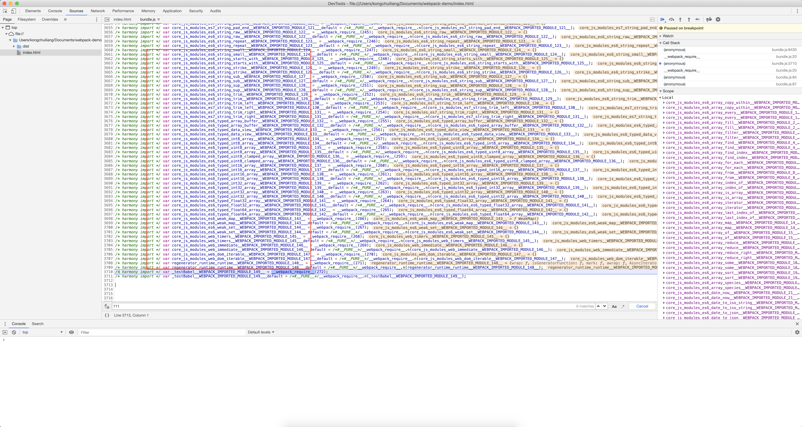

可以看到，100多个垫片api被引入。实际只用到了几个而已。

再来看看usage的情况：

```js
// babel.config.js
module.exports = function (api) {
    api.cache(true);

    const presets = [
        [
            "@babel/env",
            {
                debug: true,
                useBuiltIns: 'usage'//新加的参数
            }
        ]
    ];
    const plugins = [];

    return {
        presets,
        plugins
    };
}
// src/index.js
console.log('hello webpack')

import './testBabel';

```
使用usage的方式，不需要在项目入口手动导入polyfill，所以去掉index.js中的代码，并把useBuiltIns设置为usage。

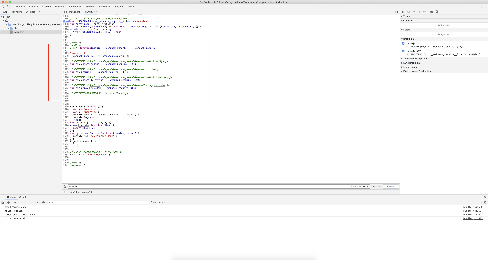

可以看到，只有使用到的垫片api才被引入。

刚才使用polyfill的usage模式貌似完美解决了对ES6+的api的支持，但是依然从polyfill的实现原理来看，它是通过重写这些api的实现，这在应用开发中问题不大，但如果在库、工具中的开发中引入polyfill就会带来潜在问题。试想一下有一个工具使用了polyfill(假设polyfill了Promise实现)，现在隔壁的小伙刚好搜到这个工具包，下下来在他的项目里使用，这本来没问题，但如果这个小伙的项目里自己实现了Promise，这就坏了，这就冲突了！！！如下图所示：

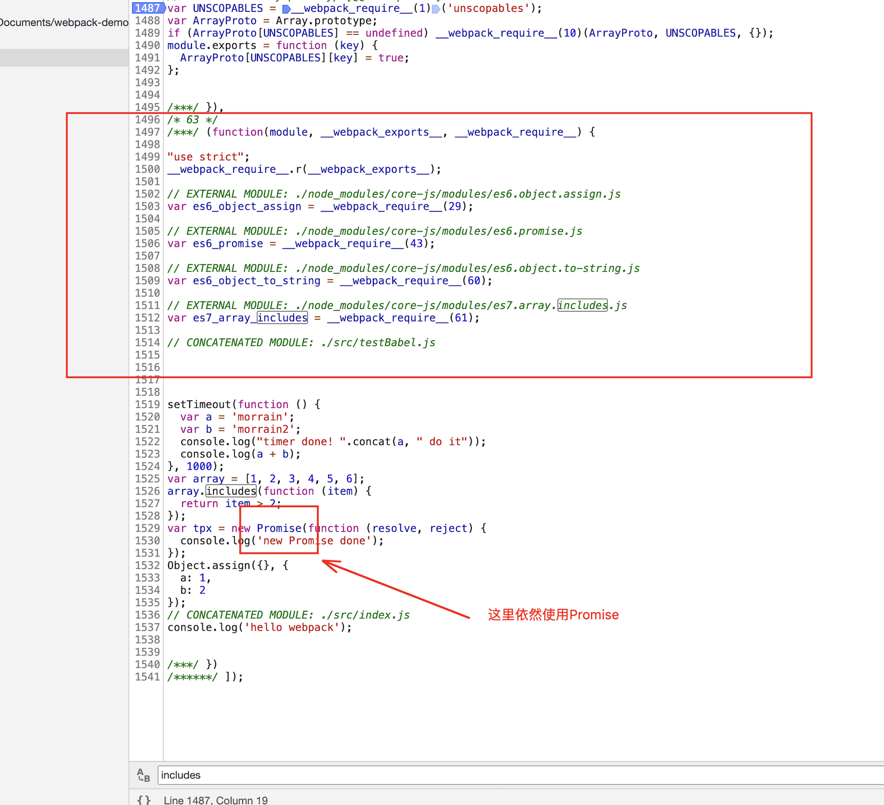

这个场景很常见，那怎么办呢？Babel针对这种场景开发了babel-runtime。它包括了两个模块:

- babel-plugin-transform-runtime 用于构建过程的代码转换
- babel-runtime 是实际导入项目代码的功能模块

它实现的原理是把所有需要支持的api，譬如Promise实现为_Promise，然后组件内部使用_Promise，这样就和组件外面做了隔离。

**使用babel-runtime替换polyfill**        

参考[官网文档](https://babel.docschina.org/docs/en/babel-plugin-transform-runtime)

```bash
// 安装@babel/plugin-transform-runtime到devDependencies
npm i -D @babel/plugin-transform-runtime  

// 安装@babel/runtime-corejs2 到 dependencies
npm i -s @babel/runtime-corejs2   

// 去掉@babel/polyfill    
npm uninstall @babel/polyfill             
```

```js
// babel.config.js
module.exports = function (api) {
    api.cache(true);

    const presets = [
        [
            "@babel/env",
            {
                debug: true//去掉了useBuiltIns参数，不再使用polyfill
            }
        ]
    ];
    const plugins = [
        [
            "@babel/plugin-transform-runtime",//新增加babel-runtime插件
            {
                "corejs": 2
            }
        ]
    ];

    return {
        presets,
        plugins
    };
}

```
打包编译之后，如下图所示，可见全局的Promise变成了局部变量promise_default.a了。

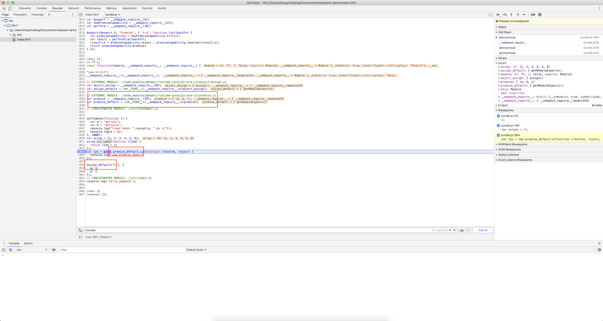

>虽然polyfill在开发非工具包时问题不大，但是还是推荐大家所有项目都使用babel-runtime的方式。

现在我们就完成了对babel-loader的所有配置，其它loader的使用方式的学习都类似，找相应loader的文档，进行安装和配置就好了。**方法是相通的，方法是相通的，方法是相通的。一定要通过调试webpack打包后的源码去深入研究编译前后的变化。**

###  3.4. <a name='plugin'></a>plugin

plugin是webpack核心功能，通过plugin webpack可以实现loader所不能完成的复杂功能，使用plugin丰富的自定义[api](https://webpack.js.org/api/plugins)以及[生命周期事件](https://webpack.js.org/api/compiler-hooks)，可以控制webpack编译流程的每个环节，实现对webpack的自定义功能扩展。

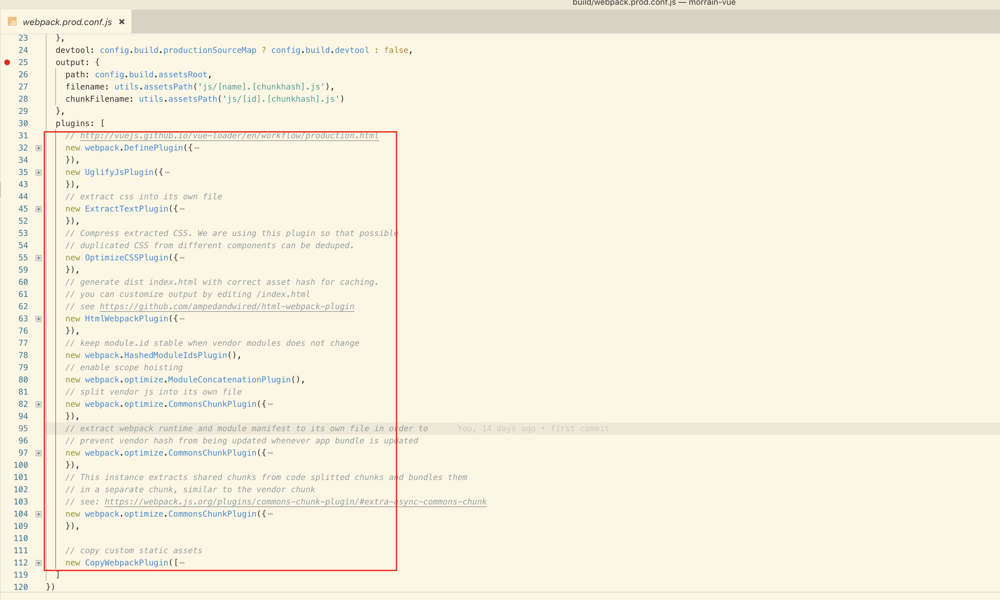

上图是我从vue的工程里截取的，它用到这么多插件，webpack的插件就是类似这么配置的，可以看到plugins是一个数组，那么问题来了，这些插件之间有顺序关系吗？

要解开这个疑问，先从调试webpack构建流程说起。

####  3.4.1. <a name='webpack'></a>调试webpack的运行过程

调试是每个程序员必备的技能，作为前端开发，我们调试客户端脚本离不开chrome devtools。但webpack的运行是跑在Node环境的，并不是浏览器环境。所以Node脚本如何调试呢？

最早我们可能会用console.log或者node-inspector，但2016年，Node@6.3版本内置了v8-inspector，正式确定了将chrome devtools作为官方的Node调试工具，使得Node脚本也可以使用chrome devtools的图形界面调试，大大方便了开发者。

**如何调试Node脚本**

```bash
node xxx.js
```

首先我们知道可以通过上面的命令使用Node来执行js脚本。我们继续用之前的index.js文件。

```js
// src/index.js
console.log('hello webpack')
```
```bash
node ./src/index.js
```

执行上面的命令后，就使用node执行了index.js文件，在控制台输出了"hello webpack"。现在我们来调试这个过程。

```bash
node --inspect-brk ./src/index.js
```
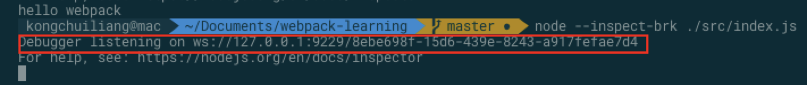

可以看到控制台提示Debugger listening on ...表示成功启动调试了。这时打开chrome devtools，可以看到如下图所示的绿色Node图标摁钮，出现这个表示当前有能够调试的Node程序。点击就可以进入代码调试环境，并断在第一行。

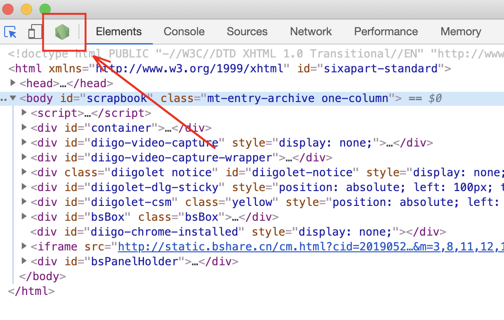

除此之外，当成功启动调试后，也可以在chrome地址栏键入 chrome://inspect或者about:inspect，回车后就可以看到下面的界面。点击inspect就会进入代码调试环境，并断在第一行。效果和刚才是一样的。两种方式都可以打开调试Node的环境。

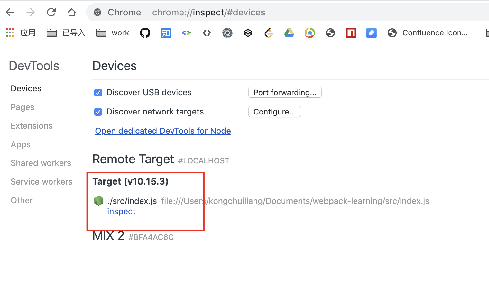

可以看到Node中的执行的index.js代码就可以使用chrome devtools来调试了。

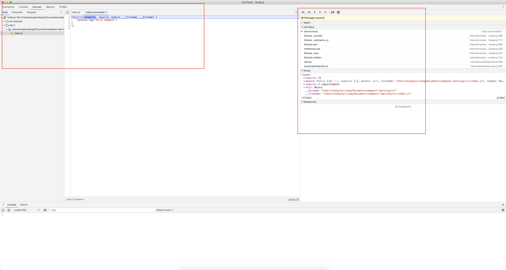

上面示例中，--inspect-brk 参数是Node启动调试模式必需的。它会在Node开始执行时就断下来，特别适用于那些只是处理某个任务，运行完就终止的脚本。对于那些会一直在后台运行的服务脚本，可以使用--inspect就可以了，这个命令参数和--inspect-brk的区别是它不会自动断在第一行。

**如何调试webpack的运行过程**

```bash
npm run start
```

```json
"scripts": {
    "start": "webpack --config webpack.config.js"
}
```
 通过`npm run start`启动webpack构建时，实际执行的是
 
 `webpack --config webpack.config.js`
 
 webpack是本地安装的模块，所以它等价于
 
 `node ./node_modules/webpack/bin/webpack.js --config webpack.config.js`

 >上面的等价关系不懂的请参考[通过npm包来制作命令行工具的原理](https://segmentfault.com/a/1190000015218126)

于是，按照我们刚才介绍的调试Node的方法，增加--inspect-brk参数：

```json
"scripts": {
    "start": "node --inspect-brk ./node_modules/webpack/bin/webpack.js --config webpack.config.js
"
}
```
```bash
npm run start
```
好了，天高任鸟飞，海阔凭鱼跃，我告诉你海在哪里，游要靠你自己！现在你可以深入到webpack的海洋里遨游了！**调试webpack执行过程是打通任督二脉的第二个秘诀！**

>对于使用vscode的同学，可以直接使用vscode在编辑器里调试的，不会可以参考[使用vscode调试npm scripts](https://www.jianshu.com/p/8b034954abc9)

####  3.4.2. <a name='pluginplugin'></a>理解plugin从编写一个plugin开始

了解过Vue或者React的同学应该都知道，这些框架库都有生命周期钩子，用来在不同的生命周期阶段开放给开发者做自己要做的事情，webpack也一样。通过插件，开发者能够获取webpack引擎完整的能力，在不同的生命周期引入特定的行为到webpack的构建流程中。所以一个插件最核心的操作就是对webpack生命周期钩子的事件订阅。

**编写插件**

webpack插件由以下要素组成：

- 一个JavaScript函数
- 该函数原型上添加apply方法
- 订阅webpack生命周期钩子
- 干想干的事情(操作webpack内部实例的数据)
- 控制权交回给webpack


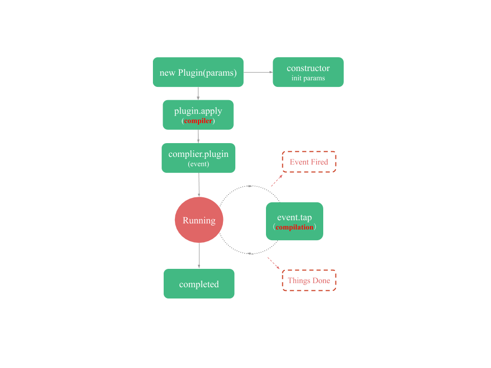
一图胜千言，上图中有两个红色加粗的概念complier和complilation，理解它们俩的角色对于开发plugin来说是非常重要的。

**compiler** 是plugin的apply接口传进来的参数，它代表了完整的 webpack 环境配置。这个对象在启动 webpack 时被一次性建立，并配置好所有可操作的设置，包括 options，loader 和 plugin。当在 webpack 环境中应用一个插件时，插件将收到此 compiler 对象的引用，可以使用它来访问 webpack 的主环境。对于 plugin 而言，**通过它来注册事件钩子**

**compilation** 对象代表了一次资源版本构建。当运行 webpack 开发环境中间件时，每当检测到一个文件变化，就会创建一个新的 compilation，从而生成一组新的编译资源。一个 compilation 对象表现了当前的模块资源、编译生成资源、变化的文件、以及被跟踪依赖的状态信息。对于plugin而言，**通过它来完成数据的处理**

新建一个build文件夹，然后新建一个CustomPlugin.js文件。修改webpack.config.js，使用CustomPlugin这个插件。

```js
// build/CustomPlugin.js

class HelloWebpackPlugin {
    constructor(params) {
        console.log('HelloWebpackPlugin init: params=', params)
    }
    apply(compiler) {
        //complier.hooks里有所有complier的钩子，这里注册了done的事件，表示当webpack构建完成时触发
        compiler.hooks.done.tap('HelloWebpackPlugin', stats => {
            console.log('HelloWebpackPlugin: webpack done!');
        });
    }
}
module.exports = HelloWebpackPlugin;

```

```js
// webpack.config.js

const HelloWebpackPlugin = require('./build/CustomPlugin');

module.exports = {
    ...
    plugins: [
        new HelloWebpackPlugin()
    ]
};

```
使用刚才介绍的调试Node的方法进行断点调试吧。

complier.hooks中存了所有complier的钩子，上例中注册了done的钩子，表示当webpack编译完成时会被触发，stats是该钩子传出来的参数，**不同的钩子传出来的参数不同**，更多钩子的信息可以查阅[官网文档相关介绍](https://webpack.js.org/api/compiler-hooks)

如示例所示，注册钩子时，使用了tap方法，它又是什么呢？我们先了解一下Tapable,Tapable是webpack的一个核心工具，它实现了事件发布订阅模式处理的插件架构，webpack中许多对象扩展自Tapable类，这个类暴露了tap、tapAsync、tapPromise方法，webpack hook便是如此，在webpack hook上就能使用这些方法注入自定义的构建步骤，这些步骤在整个编译过程中的相应时机触发。

如示例所示，使用了tap方法，因为done这个hook是同步的，它不允许这个钩子的回调中有异步操作。所以使用tap方法，但**有一些钩子是异步的**，譬如emit，它表示编译完成要输出资源文件之前的钩子，它被设计成异步的，因为webpack觉得开发者可能需要在这个过程中间去写一些额外文件的异步操作，**webpack必须等到异步操作完成，由plugin主动交回控制权。** 此时就要用到tapAsync或者Promise。下面是tapAsync和tapPromise的示例：

```js
// build/CustomPlugin.js

class HelloWebpackPlugin {
    constructor(params) {
        console.log('HelloWebpackPlugin init: params=', params)
    }
    apply(compiler) {

        const plugin_name = 'HelloWebpackPlugin';
        //complier.hooks里有所有complier的钩子，这里注册了done的事件，表示当webpack构建完成时触发
        compiler.hooks.done.tap(plugin_name, stats => {
            console.log('HelloWebpackPlugin: webpack done! ');
        });

        compiler.hooks.emit.tapAsync(plugin_name, (compilation, callback) => {
            // 做一些异步的事情……
            setTimeout(function () {
                console.log('Done with async work...');
                callback();
            }, 1000);
        });

        compiler.hooks.emit.tapPromise(plugin_name, compilation => {
            // 返回一个 Promise，在我们的异步任务完成时 resolve……
            return new Promise(resolve => {
                setTimeout(function () {
                    console.log('异步工作完成……');
                    resolve();
                }, 1000);
            });
        });
    }
}

module.exports = HelloWebpackPlugin;
```
>因为webpack同时会应用很多plugin，也就是说同一个hook可以被不同的plugin订阅，所以在订阅hook时，把plugin_name传入作为区分。

一定要注意，对于tapAsync，一定要执行callback的回调，对于tapPromise，一定要执行resolve，必须通过这样的方式将控制权交回webpack，不然webpack不会往下执行的(并行的hook除外)。

现在再来看刚才抛出来的问题，plugins有顺序吗？答案是有！但仅限于两个plugin注册同一个hook时，hook触发时有先后之后。但就这么简单吗？当然不是，因为hook的类型很多：

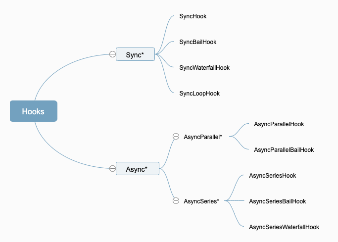

要搞清楚plugins是否有顺序，以及顺序是怎么样的问题，还要非常清楚这些hook的类型才行。不过这都不是事儿，只要应用之前提到有秘诀，都能搞定。

####  3.4.3. <a name='pluginwebpack'></a>从plugin的运行机制看webpack的全生命周期

真得不清楚为啥，在webpack官网连一个生命周期图都没有，只能自己画一个简化版的，把一些关键生命周期标示出来。

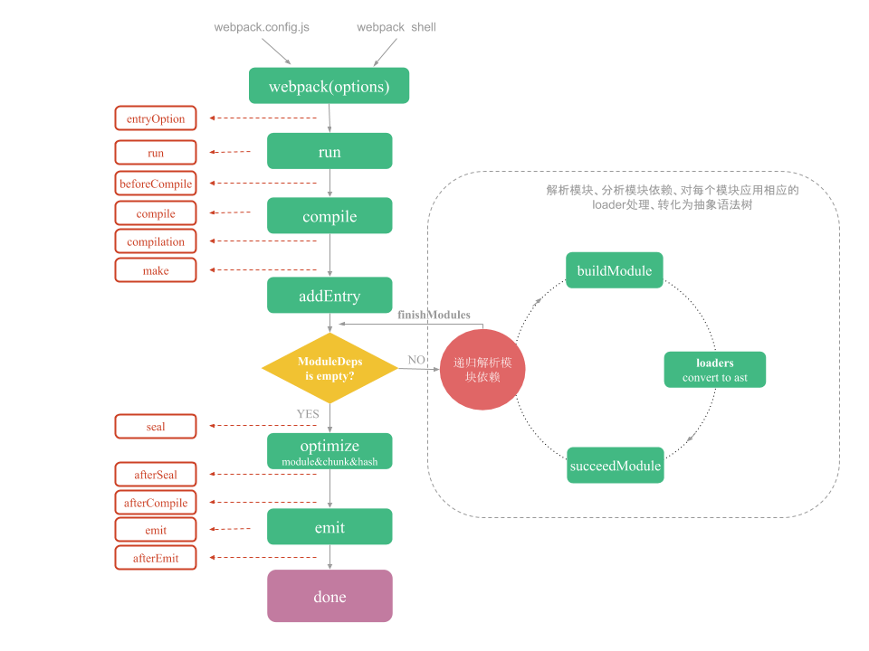

根据上面的流程图，我们来分析webpack的全生命周期流程

**webpack入口**

webpack通过Node环境执行，使用webpack.config.js配置文件，执行`./node_modules/webpack/bin/webpack.js`文件。

**webpack初始化**

- 构建compiler对象

    `let compiler = webpack(options)`

- 注册NodeEnvironmentPlugin插件

    `new NodeEnvironmentPlugin().apply(compiler);`

- 注册用户配置中的插件，并使用WebpackOptionsApply处理用户配置

    ```js
    if (options.plugins && Array.isArray(options.plugins)) {
        for (const plugin of options.plugins) {
            if (typeof plugin === "function") {
                plugin.call(compiler, compiler);
            } else {
                plugin.apply(compiler);
            }
        }
    }
    compiler.hooks.environment.call();
    compiler.hooks.afterEnvironment.call();
    compiler.options = new WebpackOptionsApply().process(options, compiler);
    ```

**run 开始编译**

**compile 触发**

**compilation 生成**  

**make 触发，调用addEntry分析入口文件，并开始创建模块对象**

**构建模块**

首先根据模块的类型获取相应的模块工厂并创建模块，对模块使用loader加载并处理，调用`acorn`解析经过loader处理后的源文件，生成抽象语法树AST。遍历AST，递归查找并构建所有依赖的模块。直至所有模块构建完成，触发finishModules。

**封装构建结果（seal）**

**优化**

依次对每个 module 和 chunk 进行整理，生成编译后的源码，合并，拆分，生成 hash 。 同时这是我们在开发时进行代码优化和功能添加的关键环节。然后通过模板（MainTemplate、ChunkTemplate）把chunk生产__webpack_requie()的格式。

**输出 (emit)**

**完成 (done)**


上面只介绍了几个关键的生命周期节点。如果要研究全部的流程怎么办呢？其实很简单，利用之前介绍的开发插件和调试插件的方法，添加相应生命周期的钩子，然后就能直观的看到当时的生命周期上下文。

新建一个自定义插件CompilerHooks。js

```js
// build/CompilerHooks.js
class CompilerHooks {
    constructor() {}
    apply(compiler) {

        const plugin_name = 'CompilerHooks';
        const hooks = compiler.hooks;

        hooks.entryOption.tap(plugin_name, (context, entry) => {
            console.log(`${plugin_name}:entryOption fired!`);
        });

        hooks.afterPlugins.tap(plugin_name, (compiler) => {
            console.log(`${plugin_name}:afterPlugins fired!`);
        });

        hooks.run.tapPromise(plugin_name, compiler => {
            console.log(`${plugin_name}:run fired!`);

            return new Promise(resolve => {

                setTimeout(() => {
                    resolve()
                }, 1000);

            });
        });

        hooks.compile.tap(plugin_name, compilationParams => {
            console.log(`${plugin_name}:compile fired!`);
        });
        hooks.compilation.tap(plugin_name, (compilation, compilationParams) => {
            console.log(`${plugin_name}:compilation fired!`);

            const hooks = compilation.hooks;

            hooks.buildModule.tap(plugin_name, module => {
                console.log(`${plugin_name}:compilation:buildModule fired!`);
            })

            hooks.optimizeChunks.tap(plugin_name, chunks => {
                console.log(`${plugin_name}:compilation:optimizeChunks fired!`);
            })

            hooks.succeedModule.tap(plugin_name, module => {
                console.log(`${plugin_name}:compilation:succeedModule fired!`);
            })

            hooks.finishModules.tap(plugin_name, module => {
                console.log(`${plugin_name}:compilation:finishModules fired!`);
            })

        });

        hooks.make.tapPromise(plugin_name, compilation => {
            console.log(`${plugin_name}:make fired!`);

            return new Promise(resolve => {

                setTimeout(() => {
                    resolve()
                }, 1000);

            });
        });

        hooks.afterCompile.tapPromise(plugin_name, compilation => {
            console.log(`${plugin_name}:afterCompile fired!`);

            return new Promise(resolve => {

                setTimeout(() => {
                    resolve()
                }, 1000);

            });
        });


        hooks.emit.tapPromise(plugin_name, compilation => {
            console.log(`${plugin_name}:emit fired!`);

            return new Promise(resolve => {

                setTimeout(() => {
                    resolve()
                }, 1000);

            });
        });

        hooks.done.tapPromise(plugin_name, stats => {
            console.log(`${plugin_name}:done fired!`);

            return new Promise(resolve => {

                setTimeout(() => {
                    resolve()
                }, 1000);

            });
        });
    }
}

module.exports = CompilerHooks;

```
```js
// webpack.config.js
const CompilerHooks = require('./build/CompilerHooks');

module.exports = {
    ……
    plugins: [
        new CompilerHooks()
    ]
};
```

**通过自定义插件，调试webpack构建的全生命周期。这是第三个精通webpack的秘诀！**


##  4. <a name='webpack-1'></a>如何使用webpack做长效缓存

###  4.1. <a name='-1'></a>什么是长效缓存

缓存（cache）一直是前端性能优化的重头戏，利用好静态资源的缓存机制，可以使我们的 web 应用更加快速和稳定。仅仅简单的资源缓存是不够的，我们还要为不断更新的资源做长效缓存，也就是说如果资源没有改变，就一直使用缓存，如果资源有变化，尽量只更新相应的缓存。这就涉及到模块化、模块依赖、静态资源优化、代码拆分、hash处理等等问题。而能把所有这些问题做好的只有webapck了。**不断完善缓存的打包优化是对webpack最好的实践**。

如果提到缓存，你只是停留在知道什么是强缓存、什么是协商缓存，或者你干脆不知道什么是cache-control/max-age/etag/last-modified。很多前端的开发，工作很多年都只是纯粹地在写页面，不懂得如何打包、如何部署、如何做缓存，不懂得什么是HTTP协议，那么在前端的全生命周期里这是不完整的，没有形成一个闭环，缺少了最重要了一步。

[未完待续……]

##  5. <a name='-1'></a>参考文献

[V8 十年故事：从农场诞生的星球最强 JS 引擎](https://v8.dev/blog/10-years)

[webpack中文文档](https://www.webpackjs.com/concepts/)

[Babel学习系列-polyfill和runtime差别(必看)](https://zhuanlan.zhihu.com/p/58624930)

[前端工程基础知识点--Browserslist](https://juejin.im/post/5b8cff326fb9a019fd1474d6)

[Babel,Babylon维基百科]

[write a webpack plugin](https://webpack.js.org/contribute/writing-a-plugin/)

[WebPack 插件机制探索](https://blog.didiyun.com/index.php/2019/03/01/webpack/)

